# 🎯 Personalized Job Recommendation System


The **Personalized Job Recommendation System** is an intelligent, machine learning-driven web application designed to combat information overload in the modern job search. By analyzing a user's specific skillset, the system utilizes Support Vector Machines (SVM) and cosine similarity algorithms to deliver highly tailored, mathematically ranked job postings.

---

## 📑 Table of Contents
1. [Summary](#-summary)
2. [Why this Project?](#-why-this-project)
3. [Design Pattern & Pipeline](#-design-pattern--pipeline)
4. [System Architecture](#-system-architecture)
5. [Key Features](#-key-features)
6. [Tech Stack](#-tech-stack)
7. [Model Evaluation & Selection](#-model-evaluation--selection)
8. [Installation & Setup](#-installation--setup)

---

## 📋 Summary
Traditional job search portals rely heavily on rigid keyword matching, which often leads to skills-gap mismatches and irrelevant results. This project solves that inefficiency by processing natural language user inputs (skills) through a trained text vectorizer. It then utilizes a highly optimized SVM classifier to predict the correct job domain, followed by a granular ranking engine that computes the cosine similarity between the user's skills and individual job descriptions to return the top 5 most relevant roles.

## 💡 Why this Project?
Job seekers spend countless hours sifting through irrelevant postings. This project was developed to provide an adaptive, nuanced alternative to standard boolean searches. By leveraging predictive modeling, the system scales effortlessly and minimizes the bias and frustration associated with traditional recruitment platforms.

## ⚙️ Design Pattern & Pipeline
This project relies on a **Two-Stage Hybrid Recommendation Pipeline**:
1. **Macro-Classification (SVM):** The user's inputted skills are vectorized and passed to a serialized Support Vector Machine (`svm_model0.pkl`), which rapidly categorizes the profile into a specific job label/domain.
2. **Micro-Ranking (Cosine Similarity):** Once the domain is identified, the system isolates all jobs within that category. It then calculates the mathematical cosine similarity between the user's skill vector and the required skills of each job, sorting them to output the top 5 ultimate matches.

## 🏗️ System Architecture

```mermaid
%%{init: {"theme": "base", "themeVariables": { "fontSize": "16px", "fontFamily": "sans-serif" }}}%%
flowchart LR
    subgraph Input [User Interface]
        A([Flask Web Portal: User Enters Skills])
    end

    subgraph Preprocessing [Data Transformation]
        B[Text Cleaning]
        C[Text Vectorizer: vectorizer0.pkl]
        B --> C
    end

    subgraph ML [Machine Learning Engine]
        D[SVM Classifier: svm_model0.pkl]
        E{Job Category Predicted}
        C --> D
        D --> E
    end

    subgraph Recommendation [Ranking System]
        F[Filter Job Data by Category]
        G[Calculate Cosine Similarity]
        H[Sort Top 5 Matches]
        E --> F
        F --> G
        G --> H
    end

    subgraph Output [Results]
        I([Display Personalized Job Postings])
        H --> I
    end

    A --> B
    
    %% Clean, cohesive, and highly readable styling
    classDef inputNode fill:#F8FAFC,stroke:#64748B,stroke-width:2px,color:#0F172A,font-size:14px,padding:10px;
    classDef processNode fill:#EFF6FF,stroke:#3B82F6,stroke-width:2px,color:#1E3A8A,font-size:14px,padding:10px;
    classDef mlNode fill:#EEF2FF,stroke:#4F46E5,stroke-width:2px,color:#312E81,font-size:14px,padding:10px;
    classDef outputNode fill:#F0FDF4,stroke:#16A34A,stroke-width:2px,color:#14532D,font-size:14px,padding:10px;

    class A inputNode;
    class B,C processNode;
    class D,E mlNode;
    class F,G,H mlNode;
    class I outputNode;
```


## ✨ Key Features
* **Interactive Web Interface:** Fully functional front-end powered by Flask, allowing users to intuitively input skills and receive instant recommendations.
* **Hybrid Machine Learning Logic:** Combines the categorical precision of SVM with the distance-based ranking of Cosine Similarity.
* **Pre-Trained Inference:** Utilizes serialized .pkl models to ensure rapid prediction times without retraining the model on every query.
* **Rigorous Algorithm Benchmarking:** The core classification model was selected after evaluating 7 distinct machine learning algorithms for maximum ROC and Accuracy.

## 🛠️ Tech Stack
* **Programming Language:** Python
* **Web Framework:** Flask
* **Machine Learning:** Scikit-Learn
* **Data Processing:** NumPy, Pandas
* **Serialization:** Pickle

## 🚀 Installation & Setup

### Prerequisites
Ensure you have Python 3.8+ and `pip` installed on your machine.

### Step-by-Step Guide
1. **Clone the Repository:**
   ```bash
    git clone [https://github.com/dR-ViBE/Personalised-Job-Recommendation-System.git](https://github.com/dR-ViBE/Personalised-Job-Recommendation-System.git)
    cd Personalised-Job-Recommendation-System
2. **Create a Virtual Environment (Recommended):**
   ```bash
   python -m venv mp_env
   source mp_env/bin/activate  # On Windows use: mp_env\Scripts\activate
   
3. **Install Dependencies:**
   ```bash
   pip install -r requirements.txt
4. **Launch the Flask App:**
   ```bash
   python app.py
## 📂 Project Structure:
```text
TransLingua/
│
├── static_data/                 # Spatial data for isolated characters
│   ├── A/                       # ~300 .npy sample files per character
│   ├── B/
│   ├── C/
│   └── ...                      # (Remaining alphabet)
│
├── dynamic_data/                # Temporal sequence data for continuous words
│   ├── hello/                   # 15-40 sequence samples per word
│   ├── thank_you/
│   ├── please/
│   └── ...                      # (10 dynamic words total)
│
├── ganeshpr_Project.ipynb       # Main execution and inference pipeline
├── requirements.txt             # Project dependencies
└── README.md                    # Project documentation
```
## 📊 Model Evaluation & Selection

During the research phase, the dataset was processed and trained across seven industry-standard classification algorithms to determine the most accurate prediction engine for job domains:

### 1. Spatial Feature Extraction
Instead of storing heavy, raw image files (which introduce noise and lighting bias), the pipeline captures specific **Hand and Pose landmarks** via a standard webcam feed using MediaPipe. These spatial coordinates are instantly extracted, normalized, and flattened into lightweight 1D NumPy arrays (`.npy`), ensuring rapid I/O operations and highly efficient model training.

### 2. Static Data Pipeline (Isolated Characters)
For static manual gestures (e.g., individual letters of the alphabet):
* **Structure:** Segregated into individual subfolders for each distinct character.
* **Volume:** Approximately **300 unique `.npy` samples** collected per character.
* **Capture Method:** Single-frame spatial coordinate extraction designed to capture the exact finger configuration and hand positioning at a specific fraction of a second.

### 3. Dynamic Data Pipeline (Continuous Words)
For dynamic, multi-motion gestures (e.g., full words or phrases):
* **Structure:** 10 dedicated subfolders, representing 10 distinct vocabulary words.
* **Volume:** **15 to 40 complete sequence samples** per word.
* **Capture Method:** Temporal windowing. Because meaning is derived from motion, each sample captures a continuous sequence of frames over a set timeframe to track the exact spatial trajectory of the gesture.

### 4. Data Quality Assurance & Preprocessing
To ensure high-fidelity model training and prevent overfitting:
* **Relative Normalization:** All spatial coordinates are normalized, ensuring the models remain invariant to the user's distance from the camera or varying body proportions.
* **Consistency:** The automated collection script verifies the matrix shape and integrity of every `.npy` file, guaranteeing uniform data dimensions before the arrays are fed into the Scikit-Learn training pipelines.
